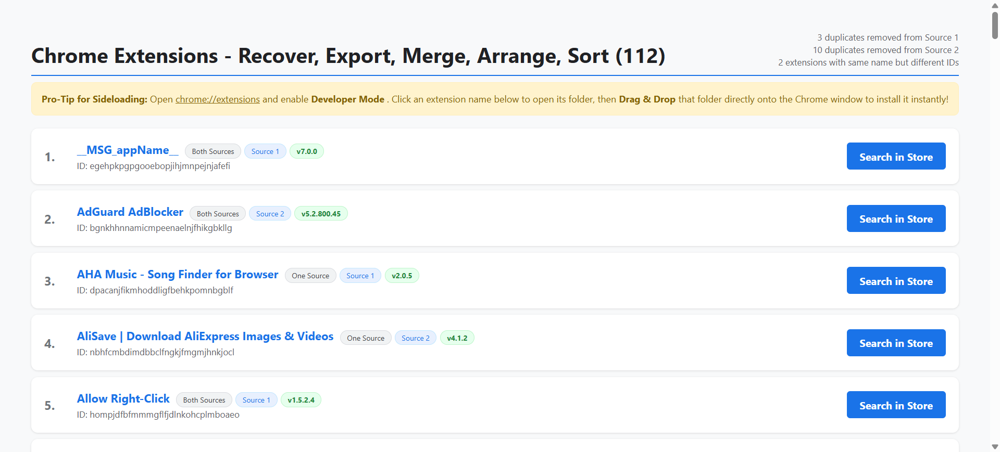

# 🚀 Chrome Extensions - REMAS by Zulali
### **R**ecover • **E**xport • **M**erge • **A**udit • **S**ort

**REMAS** is the ultimate power-user utility for managing Chrome extension chaos. Whether you are migrating across machines, merging work and personal profiles, or rescuing "lost" extensions from a backup, REMAS automates the entire lifecycle of extension management.

---

## 🛠 What is REMAS? (The Process)
Managing 100+ extensions across different profiles is usually a manual nightmare. **REMAS** turns this into a 10-second automated process:

1.  🔍 **Deep Scan:** The engine dives into your raw Chrome data, bypassing cryptic 32-character folder names (IDs).
2.  📂 **Structure Flattening:** It extracts the active source code from nested version sub-folders and brings them to the surface.
3.  ⚖️ **Version Auditing:** If an extension exists in both sources, REMAS compares the version strings (e.g., `v2.4.1` vs `v2.4.0`) and **only keeps the latest one**.
4.  🏷 **Human-Readable Renaming:** It reads the internal `manifest.json` (and locale files) to rename folders from gibberish to their actual names (e.g., `ghbmn...` becomes `Volume Master`).
5.  🖥 **Dashboard Generation:** It builds a custom **Extensions.html** "Launchpad" for one-click recovery, store-searching and sideloading.

---

## 💎 Why Power Users Need This
If you have 100+ extensions, you know the pain of "Profile Drift." 

*   **⚡️ Profile Merging:** Finally combine your curated list of extensions from your **Work Laptop** and **Home PC** into one master profile.
*   **🛡 Rescue "Deleted" Tools:** If an extension is removed from the Web Store, you can’t get it back—unless you have the raw source. REMAS saves that source code permanently.
*   **🔓 Manifest V2 Continuity:** For users who rely on legacy MV2 tools (like specific ad-blockers or scrapers), REMAS provides the "Load Unpacked" path to keep them running in Chrome 144 and Latest.
*   **📋 Clean Audit:** Stop wondering which profile has the newest version. REMAS identifies the winner for you.

---

## 🚀 Quick Start Guide

### 1. 📂 Preparation
*   Place your source folders on your Desktop.
*   The script looks for **Extensions_1** (or simply **Extensions**) and **Extensions_2**.
*   *Note: If you only have one source, just ensure it is named "Extensions" or "Extensions_1".*

### 2. ⚙️ Configuration
Open the **REMAS script** in **Notepad** (or any text editor) and change the `$user` variable to match your Windows user folder name. 
*   **Example:** If your Windows user folder is `C:\Users\JohnDoe`, change the line to: `$user = "JohnDoe"`.
*   Once edited, **Select All (Ctrl+A)** and **Copy (Ctrl+C)** the entire script.

### 3. ⚡ Execute the REMAS Process
Open **PowerShell as Administrator**, paste the entire copied script, and hit **Enter**. The engine will immediately begin auditing your folders and will generate the **Chrome Extensions - REMAS** folder on your desktop.

### 4. 🔓 Unlock Chrome 144 or Latest (The Bypasses for Sideloading)
Google blocks legacy extensions by default. Use these to stay in control:

**Why is this required?** Google has officially deprecated Manifest V2 extensions in Chrome 144+. Without these bypasses, Chrome will automatically disable your recovered legacy extensions and block you from re-enabling them. Implementing either (or both) of these ensures you stay in control of your software:

*   **Option A: Registry Fix (Recommended - Best for "Set & Forget"):**
    This is the most reliable method. It applies a system-wide policy so your extensions work no matter how you launch Chrome.
    ```powershell
    # Forces Chrome to allow Manifest V2 support
    $path = "HKLM:\SOFTWARE\Policies\Google\Chrome"
    if (!(Test-Path $path)) { New-Item -Path $path -Force }
    New-ItemProperty -Path $path -Name "ExtensionManifestV2Availability" -Value 2 -PropertyType DWORD -Force
    ```
*   **Option B: Shortcut Target Fix (Best for non-Admin users):**
    Use this if you cannot edit the Registry. It enables the Legacy feature directly in the browser engine.
    Add this to the end of your Chrome shortcut **Target** field (after the quotes):
    ```text
    --enable-features=AllowLegacyMV2Extensions
    ```
**Note:** For the most stable experience in 2026, implementing **both** is highly recommended to bypass both policy checks and engine-level blocks simultaneously.

#### **Which one is the "Better" option?**
The **Registry Fix** is the superior, "Set and Forget" option. 
* **The Winner (Registry):** It applies a system-wide policy. Once you run the PowerShell command, your extensions stay active no matter how you launch Chrome (Taskbar, Start Menu, or clicking a link in another app).
* **The Runner-Up (Shortcut):** This only works if you launch Chrome specifically from *that* modified icon. If Chrome is opened by another program, the bypass won't load.

#### **Are both required?**
* **No, but they work better together.** 
Using the **Registry Fix** ensures the policy allows the extension to exist, while the **Shortcut Parameter** tells the Chrome engine to ignore the "Unsupported" warnings.

### 5. 📥 Extensions Installation
Open the generated **`Extensions.html`** in Chrome to begin restoring your setup:
*   **Option A (Web Store):** Click the **Search in Store** button to find and install the official, latest version from Google.
*   **Option B (Sideloading):** For removed or legacy extensions, click the **Extension Name** to open its local folder, then **Drag & Drop** that folder into `chrome://extensions` (ensure **Developer Mode** is ON).

> **💡 POWER-USER TIP:** If your browser security blocks the folder from opening automatically when you click the name, don't sweat it! Just manually open the **Chrome Extensions - REMAS** folder on your desktop. From there, you can manually drag and load all your unavailable or older Manifest V2 extensions to bypass Google's restrictions like a boss.

---

## 📝 Release Notes - v0.79 (Beta)
> *"The Precision Update"*

*   **✨ New! 3-Label Badge System:** Every extension now displays:
    *   `Source Count` (One Source vs Both Sources).
    *   `Winner Origin` (Source 1 vs Source 2 - identifying which file was kept).
    *   `Version Badge` (Live version number audit).
*   **🛠 Smart Search Logic:** Fixed the `/search/` URL structure to find re-uploaded or rebranded extensions in the Store.
*   **📊 Optimized Header:** Added a real-time Audit Summary showing exactly how many duplicates were purged from each source.
*   **📂 Folder Collision Fix:** Added the `_d` logic. If two *different* extensions have the same name, REMAS now saves both instead of overwriting.
*   **🌍 Localized Recovery:** Improved "Deep Scan" for localized apps (Fixes the `__MSG_` naming bug).
*   **🔢 Sequential Numbering:** Added list numbering to the HTML for easier "check-listing" during bulk installs.

## 🖥️ Screenshot of the generated dashboard Extensions.html file



> **Note:** This is how your `Extensions.html` will look after the **REMAS Engine** finishes its audit. Every extension is numbered, categorized by source, and includes a direct search link.

